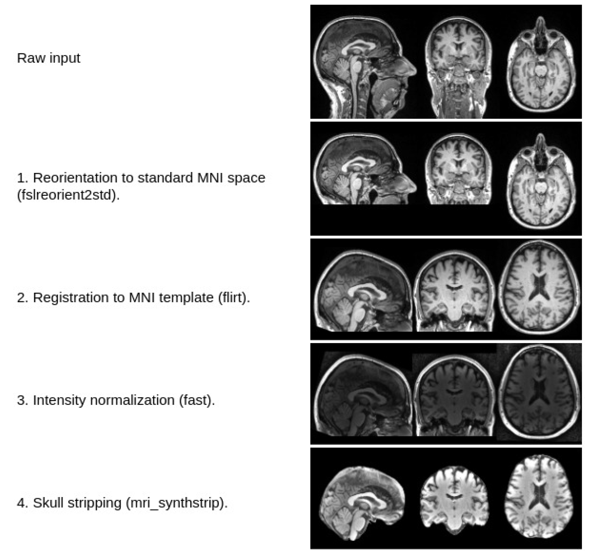

# Processing Scans

Here I introduce procedure of processing T1 MRI scans and options to achieve each procedure. Below is one of the pipeline used in [Ovidijus Grigas, et al](https://www.mdpi.com/2075-1729/13/9/1893). Here we strip the skull first, followed by registration.


- [Processing Scans](#processing-scans)
  - [0. From `.dcm` to `.nii`](#0-from-dcm-to-nii)
    - [`dcm2niix`](#dcm2niix)
    - [python: `dicom2nifti`](#python-dicom2nifti)
  - [1. Skull-stripping](#1-skull-stripping)
    - [FSL: `bet`](#fsl-bet)
    - [Freesurfer: `recon-all -autorecon1`](#freesurfer-recon-all--autorecon1)
    - [`hd-bet`](#hd-bet)
    - [`mri_synthstrip`](#mri_synthstrip)
  - [2. Registration](#2-registration)
    - [ANTs](#ants)
    - [FSL: `flirt`](#fsl-flirt)
    - [Can we do brain registration with python?](#can-we-do-brain-registration-with-python)
  - [3. Segmentation](#3-segmentation)
    - [Freesurfer `recon-all`](#freesurfer-recon-all)
    - [Fastsurfer](#fastsurfer)
    - [Synthseg](#synthseg)

## 0. From `.dcm` to `.nii`
Medical images use the standard format called **DICOM**. This imaging format provides a 2D slice image, which leads to dicom sequences per MRI image, which makes it hard to analyze neuroimages. To enclose all slices into single file, we can use **NIFTI** format. However, converting this by yourself is very nagging, since integration requires checking metadata from all slices is consistent. One can achieve this easily via following commands.

### [`dcm2niix`](https://github.com/rordenlab/dcm2niix)
`dcm2niix` is a popular tool for converting DICOM files to NIfTI format. It efficiently handles the conversion while preserving essential metadata, making it a reliable choice for neuroimaging data processing.
```bash
dcm2niix -z y -f %p_%s -o /output/path /input/path
```

### python: [`dicom2nifti`](https://dicom2nifti.readthedocs.io/en/latest/)
dicom2nifti is a Python package that provides functionality to convert DICOM files to NIfTI. It is particularly useful for integrating conversion processes into Python-based workflows.

```python
import dicom2nifti

dicom2nifti.convert_directory('/input/path', '/output/path', compression=True)
```
This code snippet converts all DICOM files in the specified input directory to compressed NIfTI files in the output directory.


## 1. Skull-stripping
Skull-stripping is the process of removing non-brain tissues (such as skull and scalp) from MRI images. This step is essential because it isolates the brain for more accurate subsequent analyses, such as segmentation and registration. This process is also called as "brain-extraction" process. 

### FSL: `bet`
`bet` (Brain Extraction Tool) is a widely-used FSL tool for skull-stripping. BET applies an algorithm that uses intensity thresholding and a deformable model to identify and remove non-brain tissues. User first needs to install FSL to use `bet` command. FSL provides an [easy python installation](https://fsl.fmrib.ox.ac.uk/fsl/docs/#/install/index) process.
```bash
bet input.nii.gz output_brain.nii.gz -f 0.5 -g 0
```
- [BET User Guide](https://web.mit.edu/fsl_v5.0.10/fsl/doc/wiki/BET(2f)UserGuide.html)
- [Brain Extraction Example](https://medium.com/selective-sapience/how-to-use-fsl-brain-extraction-9a83aa100796)


### Freesurfer: [`recon-all -autorecon1`](https://surfer.nmr.mgh.harvard.edu/fswiki/recon-all)
If you have installed your freesurfer, `recon-all` command maybe an option. This command does a full cortical reconstruction process, strating from raw MRI scans. Users are allowed to partly utilize `recon-all` process via `autorecon` flags. However this command takes long time and we have extra options.

### [`hd-bet`](https://github.com/MIC-DKFZ/HD-BET)
Since many neuroscience packages were developed before an era of AI, they does not utilize GPU resources for such process. `hd-bet` is a deep learning-based tool for skull-stripping, providing high accuracy and reliability.

### `mri_synthstrip`
`mri_synthstrip` also leverages deep learning algorithm to efficiently strip skulls. This is [now integrated in freesurfer](https://github.com/freesurfer/freesurfer/tree/dev/mri_synthstrip).
```bash
mri_synthstrip -i input.nii.gz -o stripped.nii.gz
```


## 2. Registration
Registration aligns images from different sources, whether they are from different time points, modalities, or subjects, into a common reference space. This is critical for comparative analysis, longitudinal studies, and multi-modal imaging. This means that we are moving one brain to another, which can be pair of fMRI and anatomical-MRI or moving a whole dataset to a target template. One of the widely used template is MNI152. `nilearn` also provides mni152 template in python.

### [ANTs](https://github.com/ANTsX/ANTs)
Advanced Normalization Tools (ANTs) is known for its robust non-linear registration capabilities, particularly useful for aligning anatomical structures across subjects. ANTs provide nice resources for newcomers, such as [assorted tutorials](https://github.com/stnava/ANTsTutorial), or support in R([ANTsR](https://github.com/antsx/antsr), [ANTsRNet](https://github.com/antsx/antsrnet)) and python ([ANTsPy](https://github.com/antsx/antspy), [ANTsPyNet](https://github.com/antsx/antspynet)).

Registration process can be done via `antsRegistrationSyNQuick.sh` command and look up [tutorial from brainminds](https://dataportal.brainminds.jp/ants-tutorial) for details. I used `parallel` for concurrency with following code.
```bash
find $SRC_DIR -type f -name "*.nii" | parallel -j 4 '
    echo Processing {}
    inp_nii={}
    out_nii="${inp_nii/$SRC_DIR/$TRG_DIR}"
    out_nii="${out_nii%.nii}_"
    intm_dir=$(dirname "$out_nii")

    mkdir -p "$intm_dir"
    antsRegistrationSyNQuick.sh -d 3 -f "$TEMPLATE" -m "$inp_nii" -o "$out_nii"
'
```

### FSL: [`flirt`](https://web.mit.edu/fsl_v5.0.10/fsl/doc/wiki/FLIRT(2f)UserGuide.html)
flirt (FMRIB’s Linear Image Registration Tool) is a widely used tool for linear (affine) registration within the FSL suite. It is capable of aligning images with different resolutions and field-of-view.

### Can we do brain registration with python?
In conclusion, *yes* we can do the same job via open-source python libraries. I also started all preprocessing steps via python in the first hand. Later I found using only python is very limited and requires unncessary additional codes. I have attached [`registration.py`](registration.py) python script using [`dipy`](https://dipy.org/) library and soon find out we have burdens to again refactor and sustain additional codes. Let's try to use command line interface! Cool example code also introduced in [MEC 2023](https://zapaishchykova.medium.com/preprocessing-mri-in-python-4d67c291b8f3).

## 3. Segmentation
Segmentation divides the brain image into distinct regions or tissues, such as gray matter, white matter, and cerebrospinal fluid. This is essential for quantitative analysis and funnctional mapping.

### Freesurfer [`recon-all`](https://surfer.nmr.mgh.harvard.edu/fswiki/recon-all)
Freesurfer performs automatic segmentation as part of the recon-all pipeline, providing detailed cortical and subcortical parcellations. Users can finetune to which extent segmentation should be done.

### [Fastsurfer](https://github.com/Deep-MI/FastSurfer)
Since `recon-all` for full registration process takes a long time, CNN-based deep learning segmentation tool [`Fastsurfer`](https://www.sciencedirect.com/science/article/pii/S1053811920304985) emerged as an alternative method. Fastsurfer recommends Singularity or docker for its usage, but people who are not familiar with such environments can directly use [run_fastsurfer.sh](https://github.com/Deep-MI/FastSurfer/blob/dev/run_fastsurfer.sh) command for segmentation. I here attach [python usage](./run_fs.py) of Fastsurfer, with its [conda requirements](./requirements_fs.txt).

### [Synthseg](https://github.com/BBillot/SynthSeg)
SynthSeg is a deep learning-based segmentation tool that is integrated into Freesurfer ([starting from version 7.3.2](https://surfer.nmr.mgh.harvard.edu/fswiki/SynthSeg)). It offers efficient segmentation of cortical and subcortical structures, even in the presence of artifacts or low-quality scans.

