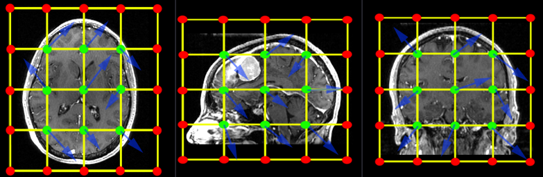
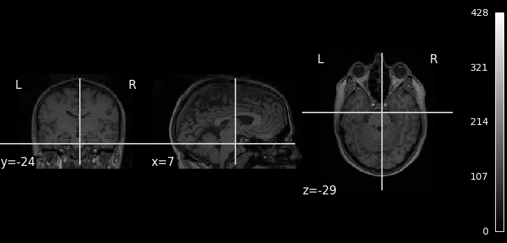
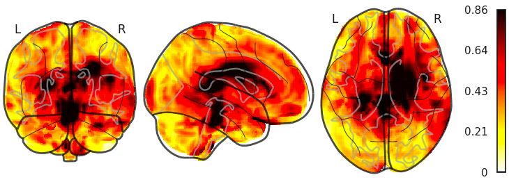
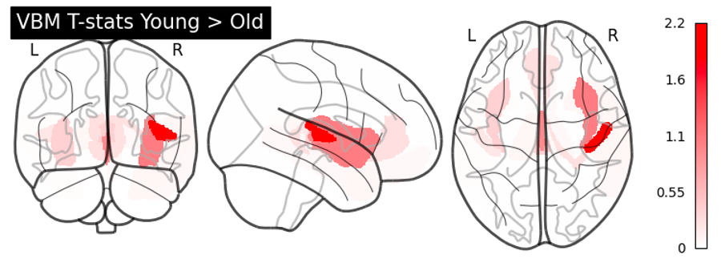
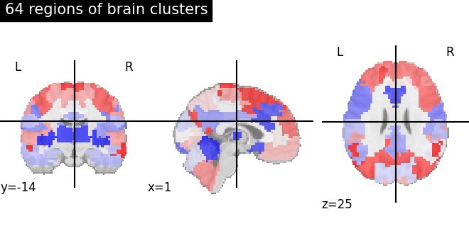
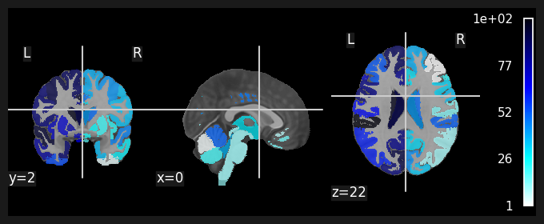
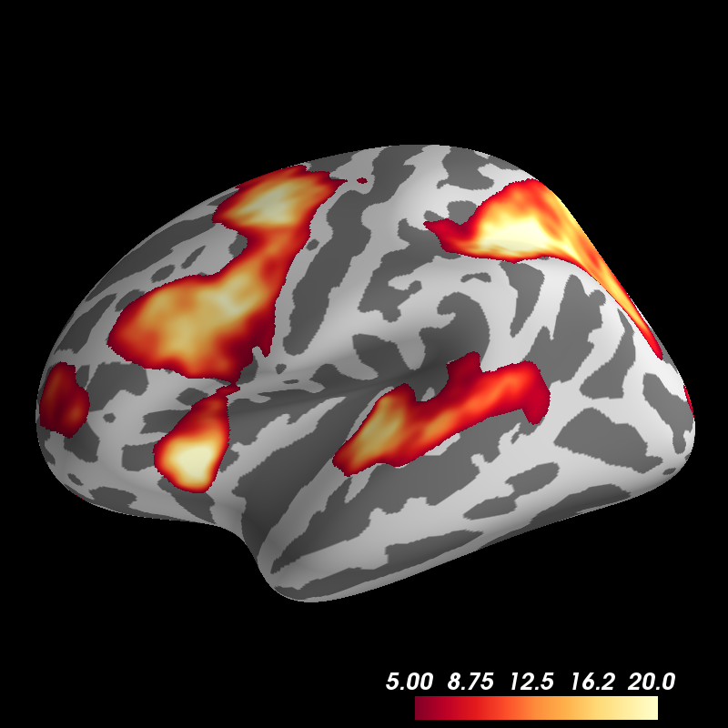

# Putting Brains into Python World

Now we know how to preprocess brain data. For deeper analysis, such as training on deep learning frameworks or visualization for data science studies, we introduce open-source Python libraries to enhance neuroimage deep learning analysis.

- [Putting Brains into Python World](#putting-brains-into-python-world)
  - [I/O](#io)
    - [`nibabel`: Read Brains](#nibabel-read-brains)
    - [`h5py`: Save brains](#h5py-save-brains)
      - [Why not `npy`?](#why-not-npy)
  - [Augmentation](#augmentation)
    - [`torchio`: Patch sampling, Augmentation](#torchio-patch-sampling-augmentation)
    - [`monai`: Medical Deep Learning Framework](#monai-medical-deep-learning-framework)
      - [Can we use both packages at the same time?](#can-we-use-both-packages-at-the-same-time)
  - [Visualization](#visualization)
    - [`nilearn.plotting`](#nilearnplotting)
      - [Preliminary](#preliminary)
      - [Plots](#plots)
    - [`pysurfer`](#pysurfer)


## I/O
Most important thing is to reading in brains and put it on python. Best tool is to read via `nibabel`. You may also need pydicom to read DICOM files, but brain images are easier to analyze when converted into NIfTI format, as introduced in[`dcm2niix`](../2_Preprocessing/README.md). 

### `nibabel`: Read Brains
[`nibabel`]() is a Python library that provides tools for reading, writing, and processing various neuroimaging file formats, including NIfTI, Analyze, and others. It is widely used in the neuroimaging community for its robust handling of complex image data.

To read a brain image using `nibabel`, you simply load the file using the `nib.load` function, which returns an [nifti-image object](https://nipy.org/nibabel/nibabel_images.html). This object provides access to the image data array, affine matrix, and header information. Here's an example of how to use `nibabel` to read a NIfTI file:

```python
import nibabel as nib

# Load a NIfTI file
nifti_file = 'path/to/your/file.nii.gz'
img = nib.load(nifti_file)

# Access the image data array
data = img.get_fdata()

# Access the affine matrix
affine = img.affine

# Access the header information
header = img.header
```

`nibabel` also supports reading and writing other file formats, making it a versatile tool for neuroimaging data manipulation. Additionally, it provides utilities for image resampling, extracting time series, and other common operations in neuroimaging analysis.

### `h5py`: Save brains
Once you have your scans in Python, storing all these NIfTI images can consume a lot of storage. You can reduce storage usage by saving .nii images as compressed .nii.gz files. However, reading many .nii.gz files can create a CPU I/O bottleneck, slowing down your model. You can make your pipeline faster by saving your brain scans in HDF5 format (.h5), which is efficient for handling large and complex datasets. Below is an example code to convert NIfTI to HDF5 format, which I have found to reduce storage and speed up data reading.
```python
from pathlib import Path

import h5py
import nibabel as nib

NIFTI_SCAN: Path

nii = nib.load(NIFTI_SCAN)
meta = dict(nii.header)

h5_path = NIFTI_SCAN.stem + ".h5"
with h5py.File(h5_path, mode="w", libver="latest") as hf:
    hf.create_dataset(
        name="volume",
        data=nii.get_fdata(), # Put array here
        compression="gzip",
        compression_opts=1,
        shuffle=True,
    )
    # One can save header in the same way
    hf.attrs.update(meta)
```

#### Why not `npy`?
Neuroimage data includes metadata essential for analysis, which npy files cannot handle. If metadata is not needed, and storage is a concern, saving scans as `npy` or compressed `npz` files might be an option.

## Augmentation
If you are familiar with Python deep learning frameworks, you may not need an introduction to these libraries. However, those new to neuroimages may struggle with augmenting brain scans, as they are often represented as 5D tensors (batch, channel, height, width, depth). Writing custom augmentation code can be time-consuming, so we introduce two libraries that facilitate this process.

### `torchio`: Patch sampling, Augmentation
TorchIO is an open-source python library that provides high-level experiences to deep learning with medical images, including data augmentation, I/O. One feature is its [patch sampling function](https://torchio.readthedocs.io/patches/patch_training.html), which is highly required when dealing with large-scale voxel images. The package also provides easy-to-use [public medical datasets](https://torchio.readthedocs.io/datasets.html). Pre-processing & augmentation is also possible with torchio. 

Medical images include augmentation that is not widely used in natural images and we can achieve this via `torchio`. One of widely used augmentation is the `torchio.transforms.RandomElasticDeformation`, which non-linearly deforms target image.
<figure>
  
  <figcaption>Source: https://torchio.readthedocs.io/transforms/augmentation.html#torchio.transforms.RandomElasticDeformation</figcaption>
</figure>

Due to internal issues within medical devices, artifacts can be seen in public datasets. We can imagine the same effect being applied as augmentation technique and this can be done with `torchio.transforms.RandomMotion` or `torchio.transforms.RandomGhosting`. We have nice tutorial materials submitted to past [MICCAI Educational Challenge](https://colab.research.google.com/github/fepegar/miccai-educational-challenge-2020/blob/master/Data_preprocessing_and_augmentation_using_TorchIO_a_tutorial.ipynb).

### `monai`: Medical Deep Learning Framework
[Project MONAI](https://github.com/Project-MONAI) began as a joint initiative between NVIDIA and King’s College London, aiming to create an inclusive community of AI researchers. Its goal is to develop and share best practices for AI applications in healthcare imaging, involving both academic and industry participants. Since its inception, the collaboration has grown to include leading figures from academia and industry within the medical imaging field.

One of the open-source library developed by Project MONAI is [MONAI - Medical Open Network for AI, an open-source Python project](https://docs.monai.io/en/stable/api.html) that focuses on providing a comprehensive framework for developing AI-based solutions in the field of healthcare imaging. It offers a range of tools and resources designed to streamline the process of building, training, and deploying deep learning models for medical imaging applications. Users can easily initiate deep learning analysis with neuroimages with MONAI, thanks to fast implementation of [neural networks](https://docs.monai.io/en/stable/networks.html#nets), [metrics](https://docs.monai.io/en/stable/metrics.html) and inference methods, extended from standard deep learning framework in that they provide methods highlighted in medical research such as FROC metric or SwinUNETR, targeted for medical deep learning.

Transformation of 3D scans is also a powerful tool supported by MONAI. Post-processing is also a very important step, such as [volumetric NMS in detection task](https://docs.monai.io/en/stable/transforms.html#probnms) or [removing small objects](https://docs.monai.io/en/stable/transforms.html#removesmallobjects). 

#### Can we use both packages at the same time?
Since two packages have augmentation not in common, some users maybe interested in using both packages. `monai` project supports `torchio.transforms` interchangeably. Here is the [example code](https://github.com/Project-MONAI/tutorials/blob/main/modules/integrate_3rd_party_transforms.ipynb) provided by `monai`.

## Visualization
We always have to check medical images during all the process for sanity check. One may wrongly apply spawned jobs on conversion commands or typos in flags, which can lead to serious errors in analysis. Best inspection is done by visualizing all brains during the process. It is good to use `matplotlib.pyplot.imshow` to visualize each slices, but we have a wrapped up package to deal with this.

### `nilearn.plotting`
Nilearn enables approachable and versatile analyses of brain volumes. It provides statistical and machine-learning tools including visualization, general linear model, functional connectivity and many other statistical analysis. Here we will focus on visualization of brain scans. `nilearn` also provides well-established example codes.

#### Preliminary
One basic thing to note is that the image fed to plotting methods should be [niimg-like object](https://nilearn.github.io/dev/manipulating_images/input_output.html#understanding-neuroimaging-data), as in [nibabel](https://nipy.org/nibabel/nibabel_images.html), which is composed with three components
- **data**: MRI array
- **affine**: Transformation matrix that maps from voxel indices of numpy array to real-world locations of the brain.
- **header**: Metadata of an image
  
This is essential in neuroimaging but from time to time you may want to plot images quickly convert your array into niimg object. I would recommend putting lambda function defined somewhere in your project, using aforementioned `nibabel` package:
```python
import nibabel as nib
_nifti = lambda arr, affine=np.eye(4): nib.nifti1.Nifti1Image(arr, affine)
```

#### Plots
To inspect single MRI scans, you may use [`nilearn.plotting.plot_anat`](https://nilearn.github.io/dev/modules/generated/nilearn.plotting.plot_anat.html). You can choose slices via `cut_coords` argument. To control direction of views, use `display_mode` argument.
<figure>
  
  <figcaption>Source: https://nilearn.github.io/dev/auto_examples/00_tutorials/plot_single_subject_single_run.html#sphx-glr-auto-examples-00-tutorials-plot-single-subject-single-run-py</figcaption>
</figure>

To highlight certain parts of the brain, [`nilearn.plotting.plot_glass_brain`](https://nilearn.github.io/dev/modules/generated/nilearn.plotting.plot_glass_brain.html) can be your option. This plots 2d projections of an image on transparent brain, making the plot more insightful overall.



One may need to visualize a specific slice instead of illustrating the overall view. Then [`nilearn.plotting.plot_roi`](https://nilearn.github.io/dev/modules/generated/nilearn.plotting.plot_roi.html) would fit. 

<figure>
  
  <figcaption>Source: https://nilearn.github.io/dev/auto_examples/01_plotting/plot_multiscale_parcellations.html#sphx-glr-auto-examples-01-plotting-plot-multiscale-parcellations-py</figcaption>
</figure>

If you are comparing two brains (let's say registration or well-overlaid, checking affines, resampling results e.t.c.), you can use `add_overlay`

```python
import nilearn.plotting as nilp

display = nilp.plot_anat(anat_img=bg)
display.add_overlay(arr, alpha=alpha)
```


### `pysurfer`
PySurfer is powerful tool to visualize three-dimensional mesh cortical surface of the brain. You can look up [examples](https://pysurfer.github.io/auto_examples/index.html) and download the codes.


<figure>
  
  <figcaption>Source: https://pysurfer.github.io/auto_examples/plot_fmri_activation.html#sphx-glr-auto-examples-plot-fmri-activation-py</figcaption>
</figure>