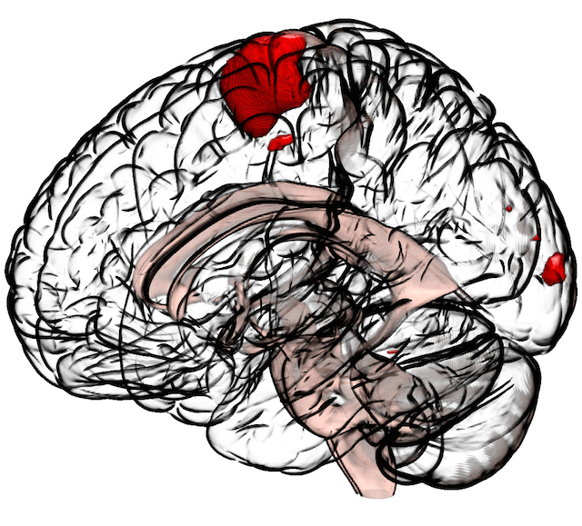
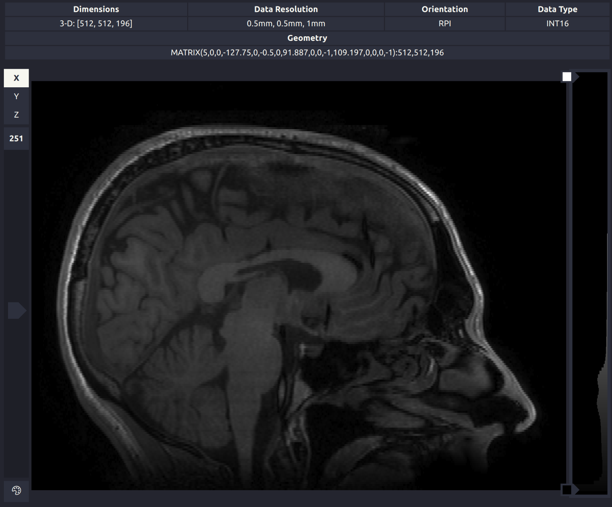
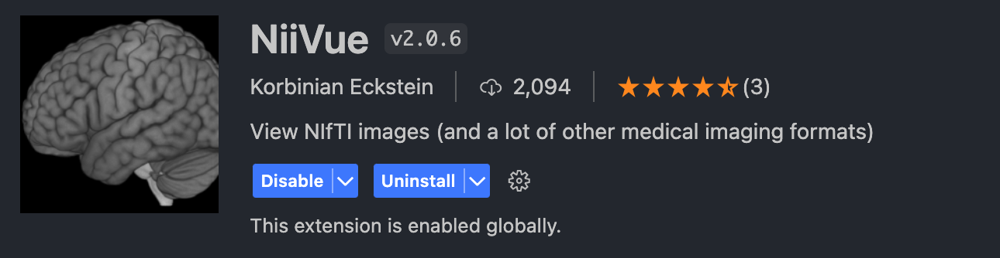
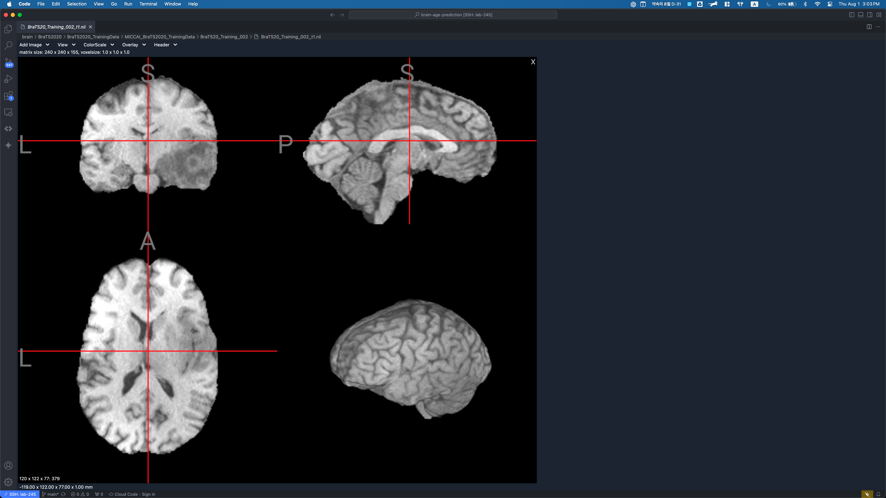

# Miscellaneous
Here I provide minor utilities that boost your productivity when working with MRI data.

- [Miscellaneous](#miscellaneous)
  - [Nifty `nifti` Viewers](#nifty-nifti-viewers)
    - [Desktop Apps](#desktop-apps)
      - [MRIcroGL](#mricrogl)
      - [ITKSnap](#itksnap)
      - [3D Slicer](#3d-slicer)
    - [VSCode Extensions](#vscode-extensions)
      - [Neuroviewer](#neuroviewer)
      - [NiiVue](#niivue)
  - [Sources](#sources)

## Nifty `nifti` Viewers
It is nagging to open your nifti file when visually checking your brain status, since most image viewers (for sure) does not support such formats. Here I introduce some tools to open medical images on your desktop.

### Desktop Apps
#### [MRIcroGL](https://www.nitrc.org/projects/mricrogl)
MRIcroGL is a lightweight and versatile medical image viewer primarily designed for visualizing and analyzing brain imaging data. It supports various file formats, including NIfTI and DICOM, and excels at rendering 3D surface and volume visualizations. One of its key strengths is the intuitive interface, which makes it accessible to both novice and experienced users. MRIcroGL also offers robust scripting capabilities, allowing users to automate image processing tasks and customize visualizations, making it a powerful tool for researchers and clinicians alike.

#### [ITKSnap](http://www.itksnap.org/pmwiki/pmwiki.php)
ITKSnap is an open-source software application designed for the segmentation of anatomical structures in medical images, such as MRI and CT scans. It stands out for its semi-automatic segmentation capabilities, which combine manual editing tools with automatic algorithms to streamline the segmentation process. The software provides a user-friendly interface with real-time 3D navigation, making it easy to visualize complex structures. ITKSnap’s strength lies in its precise and efficient segmentation tools, which are highly valued in clinical research and practice for creating accurate anatomical models.

#### [3D Slicer](https://www.slicer.org/)
3D Slicer is a comprehensive, open-source platform for medical image computing. It supports a wide range of imaging modalities, including MRI, CT, and ultrasound, and offers advanced tools for visualization, segmentation, registration, and quantitative analysis. One of 3D Slicer’s primary strengths is its extensibility; users can customize and expand its functionality through a rich set of plugins and scripts. It is widely used in both clinical and research settings, providing robust capabilities for processing and analyzing complex medical datasets, as well as for surgical planning and image-guided interventions.

### VSCode Extensions
However, there are cases where you have your nifti files not in your local device but on remote server. This becomes very essential when you batch your pipelines on remote servers, requiring you to  Assuming that you are using **VSCode** as an IDE, I recommend following extensions to view nifti files.

#### Neuroviewer

#### NiiVue

## Sources
Cool sites for neuroscience
- [Andy's Brain Book](https://andysbrainbook.readthedocs.io/en/latest/)